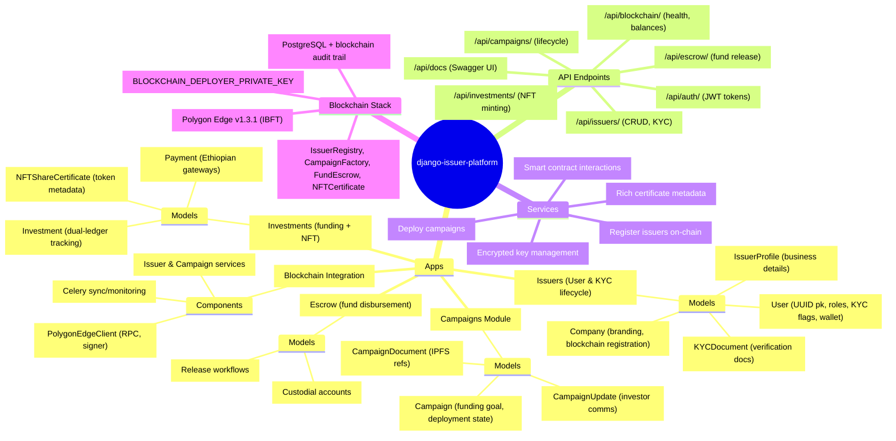
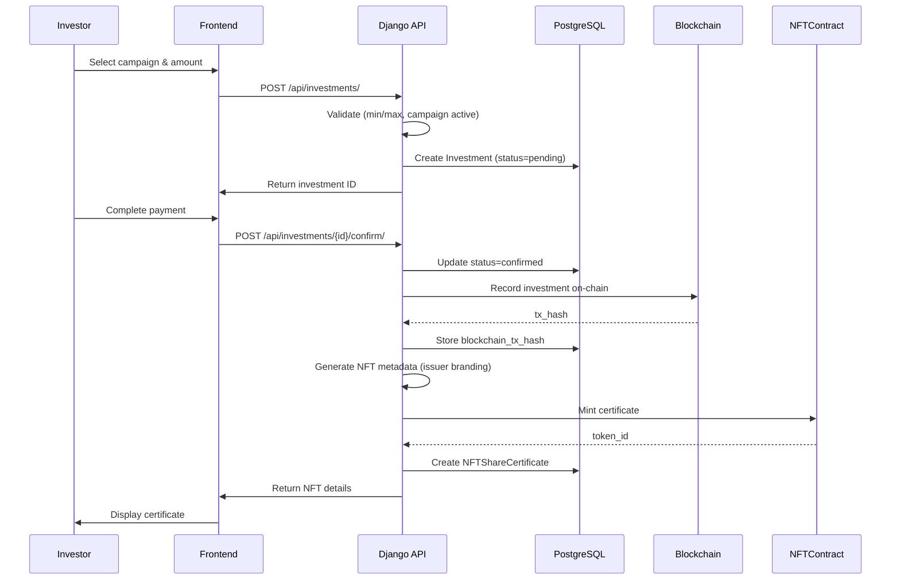
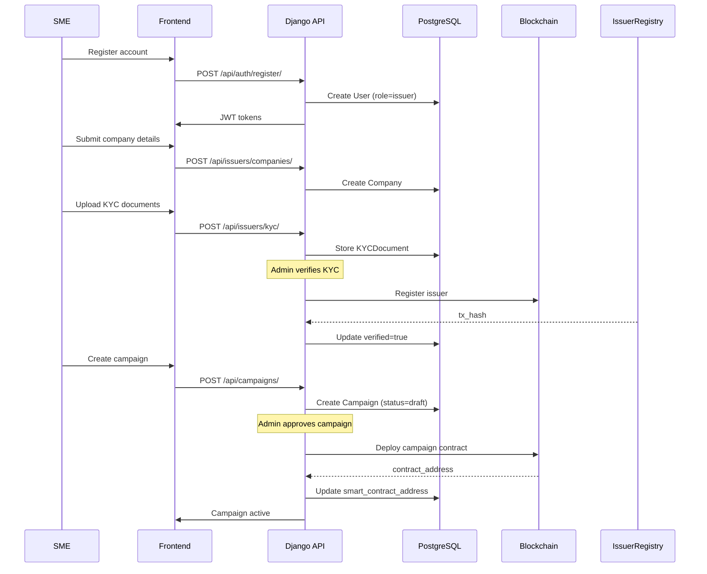
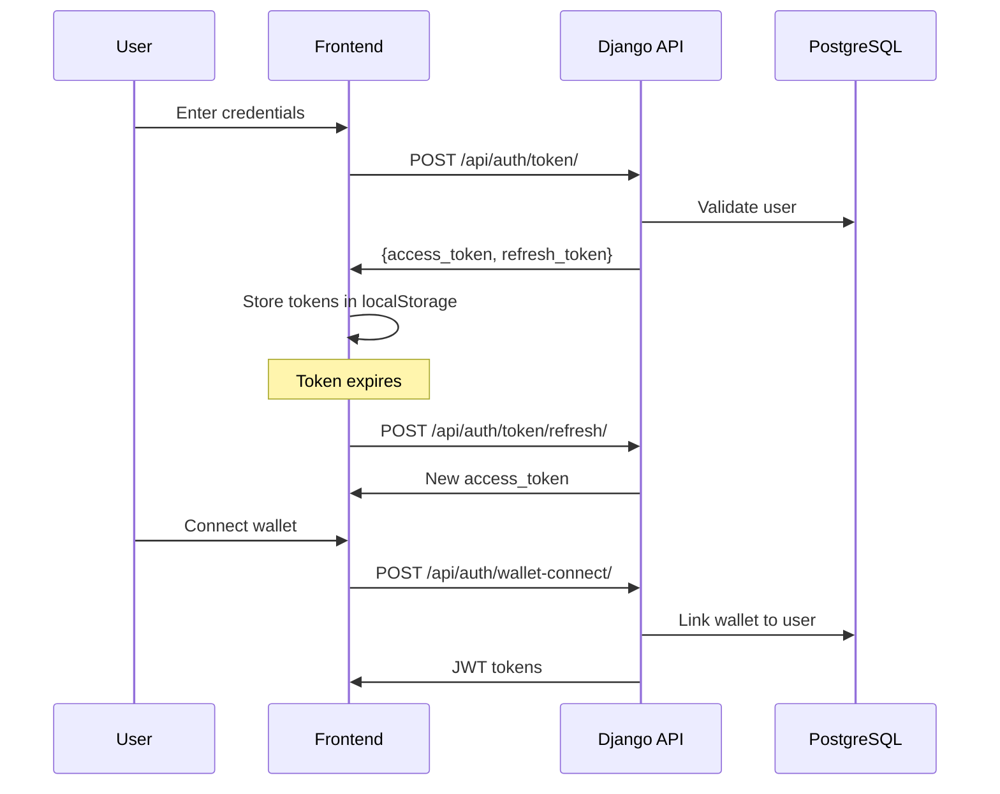
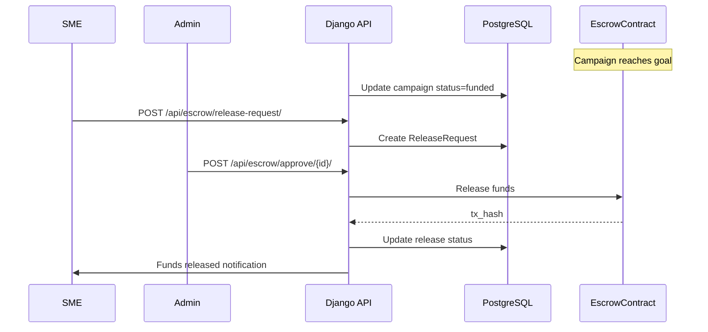
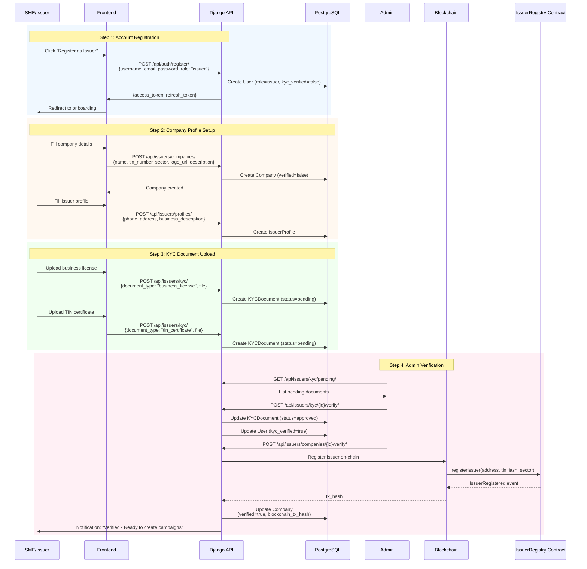
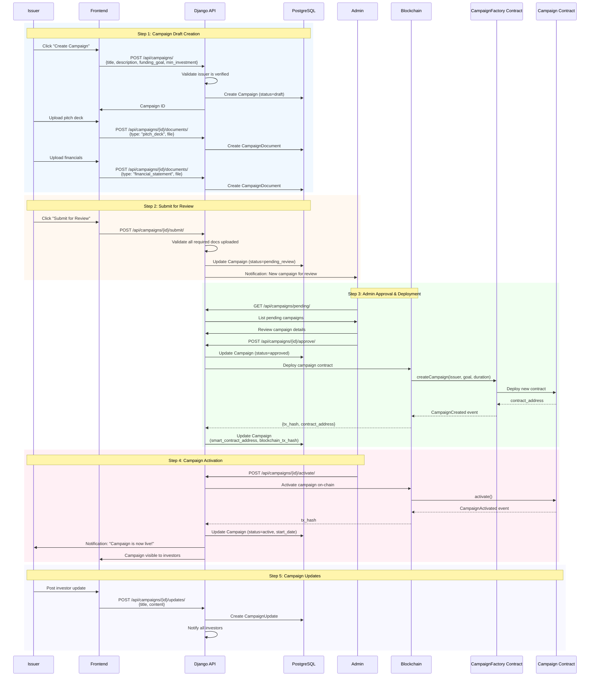
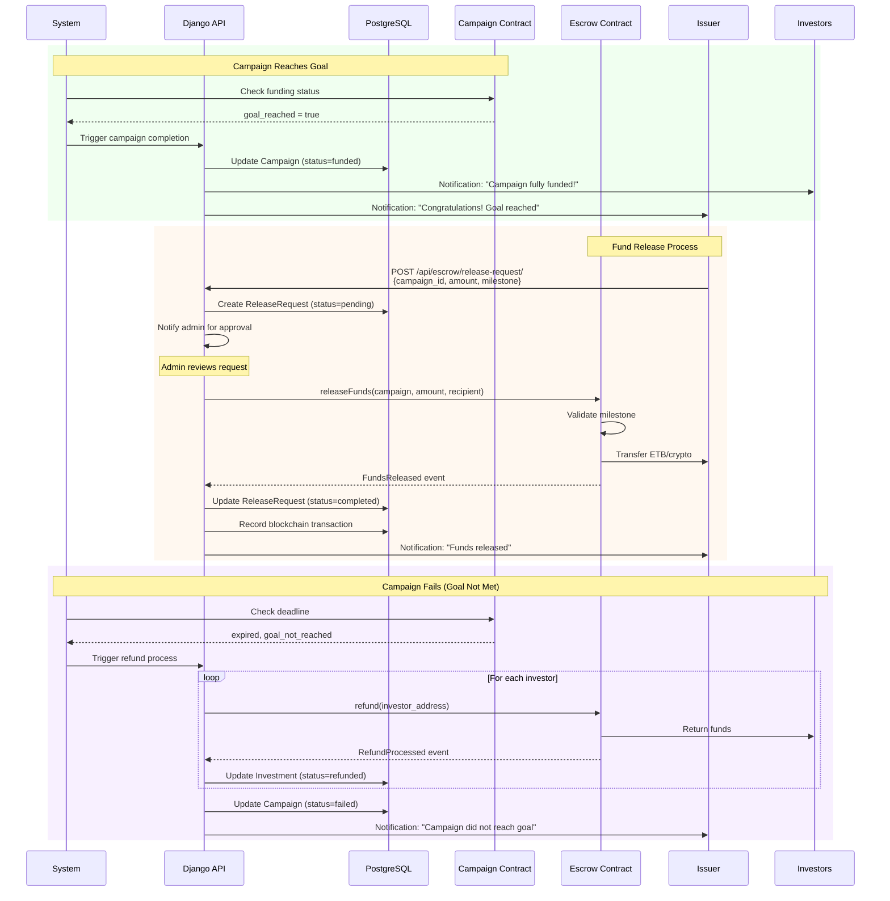
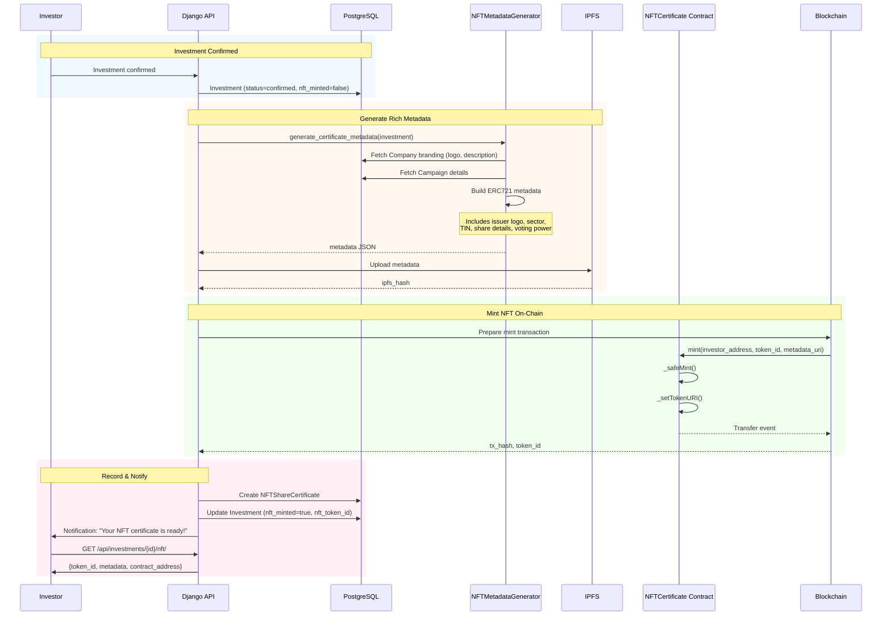

# CrowdfundChain Platform Architecture Diagrams

## Mind Map - Platform Overview

---

## Sequence Diagram 1: Investment Flow with NFT Minting

---

## Sequence Diagram 2: SME Onboarding & Campaign Creation

---

## Sequence Diagram 3: Authentication Flow (JWT)

---

## Sequence Diagram 4: Escrow & Fund Release

---

## Sequence Diagram 5: Issuer Registration & Verification Flow

---

## Sequence Diagram 6: Campaign Lifecycle Flow

---

## Sequence Diagram 7: Campaign Completion & Escrow Release

---

## Sequence Diagram 8: NFT Share Certificate Minting

---

## Viewing These Diagrams

1. **GitHub**: Push this file to GitHub - diagrams render automatically
2. **VS Code**: Install "Markdown Preview Mermaid Support" extension
3. **Online**: Copy diagrams to [mermaid.live](https://mermaid.live)
4. **Notion**: Paste Mermaid code blocks directly
